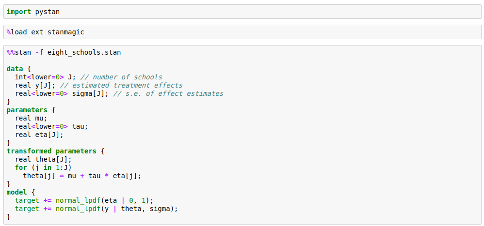

Stan_code_helper
-----------------

A jupyter nbextension for syntax highlighting of %%stan magic code cells (during edit). This package requires the stanmagic package to work (https://github.com/arvinds-ds/stanmagic)

Install Extension
---------------------

`pip install git+https://github.com/Arvinds-ds/stan_code_helper.git`

`jupyter nbextension install --py stan_code_helper --user`

`jupyter nbextension enable stan_code_helper/main`

UnInstall Extension
---------------------

`jupyter nbextension disable stan_code_helper/main`

`jupyter nbextension uninstall --py stan_code_helper --user`

`pip uninstall stan_code_helper`
